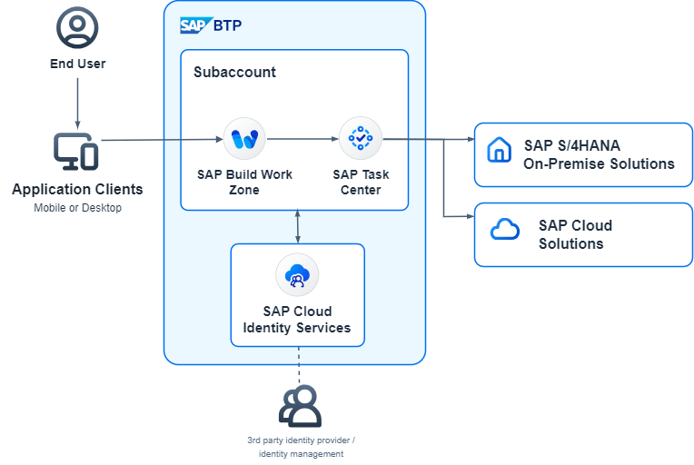
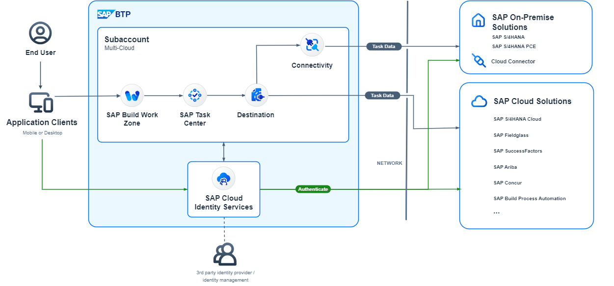
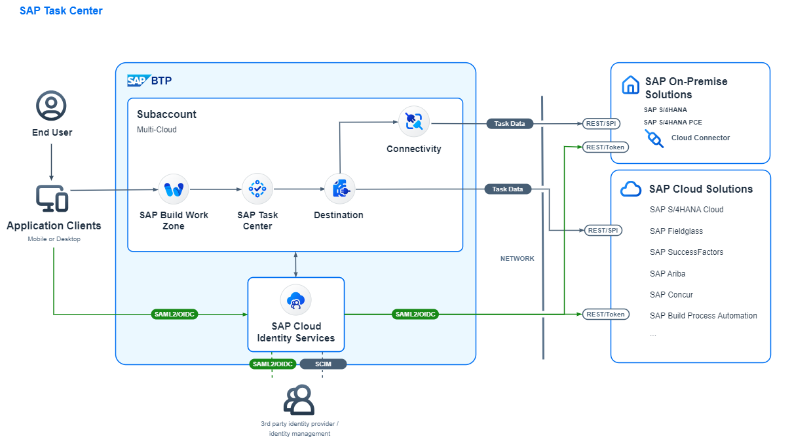
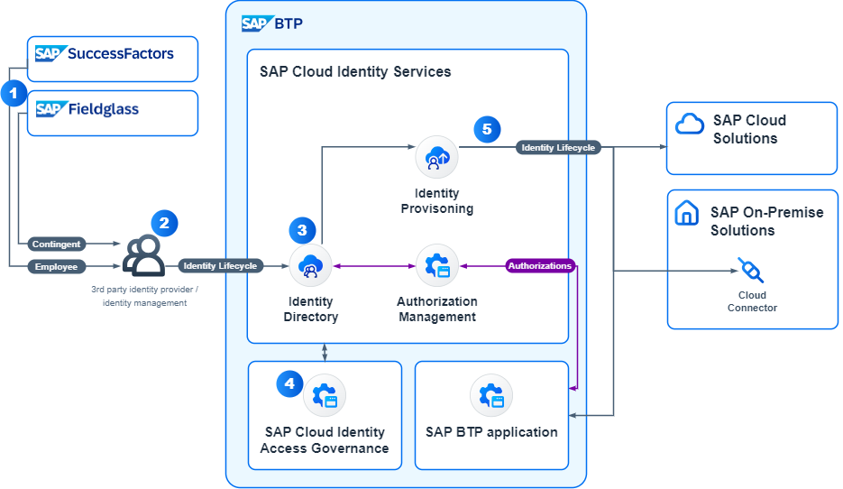
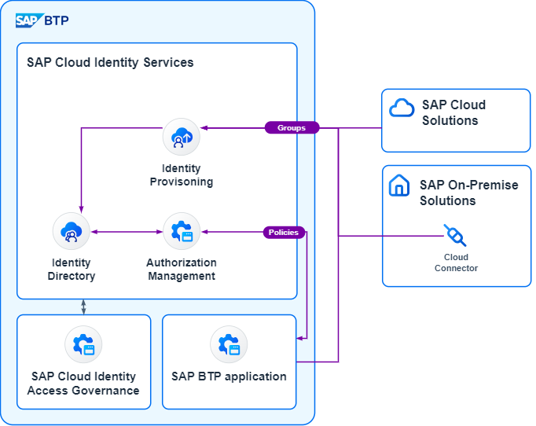
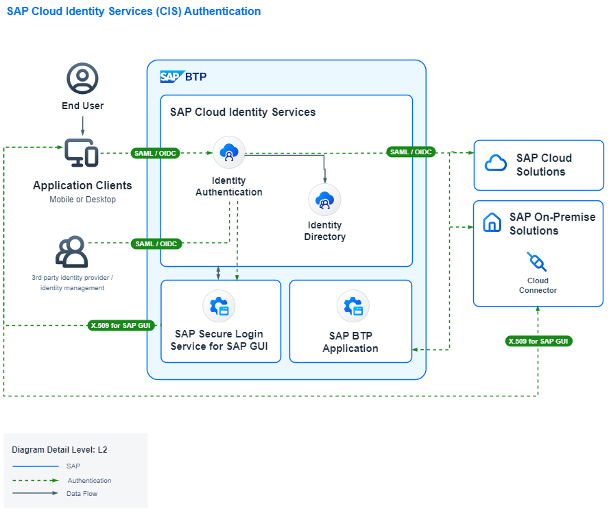

# BTP Solution Diagram Examples

## Diagram Granularity  
We will provide here based on the audience knowledge level L0-L2 diagram for the following:
  
* SAP Task Center (L0) 
  
   
  
  * [SAP Task Center (L0) drawio](SAP_Task_Center_L0.drawio)
  * [SAP Task Center (L0) drawio.png](SAP_Task_Center_L0.drawio.png)
* SAP Task Center (L1) 

  

  * [SAP Task Center (L1) drawio](SAP_Task_Center_L1.drawio)
  * [SAP Task Center (L1) drawio.png](SAP_Task_Center_L1.drawio.png)
* SAP Task Center (L2) 

  

  * [SAP Task Center (L2) drawio](SAP_Task_Center_L2.drawio)
  * [SAP Task Center (L2) drawio.png](SAP_Task_Center_L2.drawio.png)

Please clone the repository or download the associated ```.drawio``` file.
The ```.drawio.png``` can be opened and are editable via draw.io.


## More Examples
* SAP Cloud Identity Services Identity Lifecycle (L1)
 
  

  * [SAP Cloud Identity Services Identity Lifecycle L1 png](SAP_Cloud_Identity_Services_Identity_Lifecycle_L1.png)
  * [SAP Cloud Identity Services Identity Lifecycle L1 drawio.png](SAP_Cloud_Identity_Services_Identity_Lifecycle_L1.drawio.png)

* SAP Cloud Identity Services Authorization (L1)
 
  

  * [SAP Cloud Identity Services Authorization png](SAP_Cloud_Identity_Services_Authorization_L1.png)
  * [SAP Cloud Identity Services Authorization drawio.png](SAP_Cloud_Identity_Services_Authorization_L1.drawio.png)

* SAP Cloud Identity Services Authentication (L2)
  

  * [SAP Cloud Identity Services Authentication (L2) png](SAP_Cloud_Identity_Services_Authentication_L2.png)
  * [SAP Cloud Identity Services Authentication (L2) drawio.png](SAP_Cloud_Identity_Services_Authentication_L2.drawio.png)

