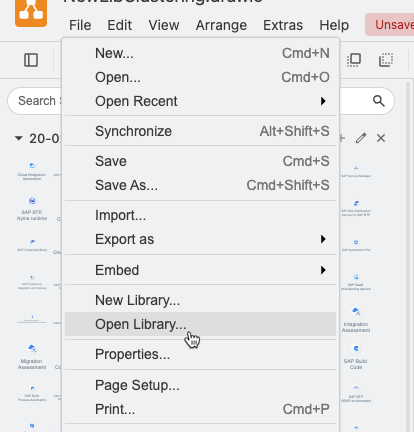

# Custom draw.io shape library for all SAP BTP service icons

## Overview 
These libraies (size S & M) contains all released generic service icons:

## How to use the libraries

For the repository on your local device and import the libraries to your local draw.io installation, please follow the instructions in the [Getting started](https://sap.github.io/btp-solution-diagrams/docs/solution_diagr_intro/intro/) section.

