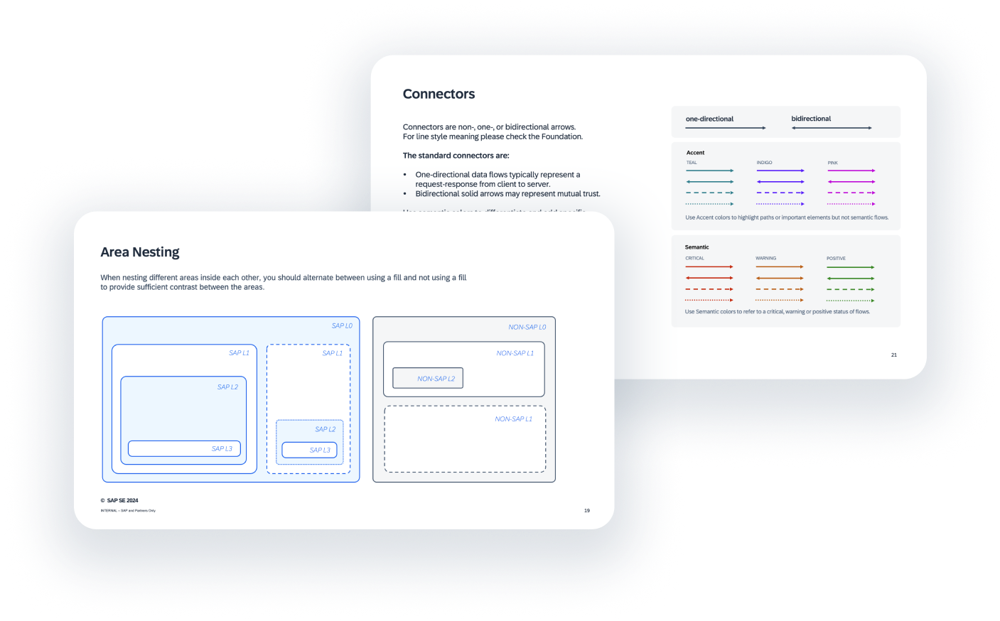

# SAP Business Technology Platform solution diagram documentation

A **SAP Business Technology Platform solution** diagram is a schematic diagram of different complexity for the representation of end-to-end solution scenarios on **SAP Business Technology Platform** to illustrate the work of SAP Business Technology Platform, its services, solutions and SAP products, and the ways of their use.

The [GitHub Pages documentation website](https://github.com/SAP/btp-solution-diagrams) is built with :blue_heart: using [Docusaurus 3](https://docusaurus.io/), a modern static website generator.