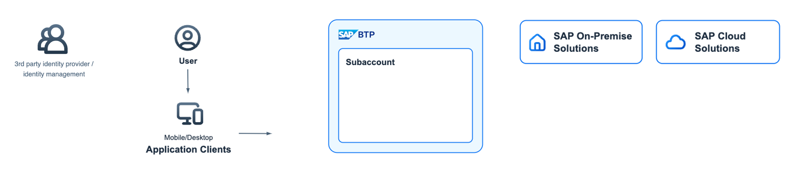

# Component Groups (Organisms)

Organisms are groups of Molecules. This could be grouped elements such as a typical shape with text and connectors, or even a whole diagram.

## Examples: User, Third Party, BTP Layer 

