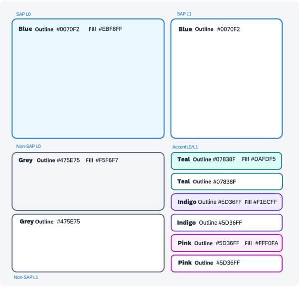
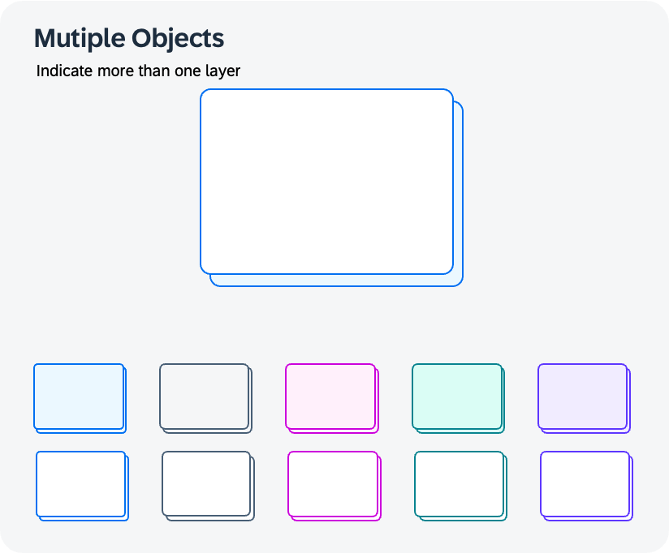
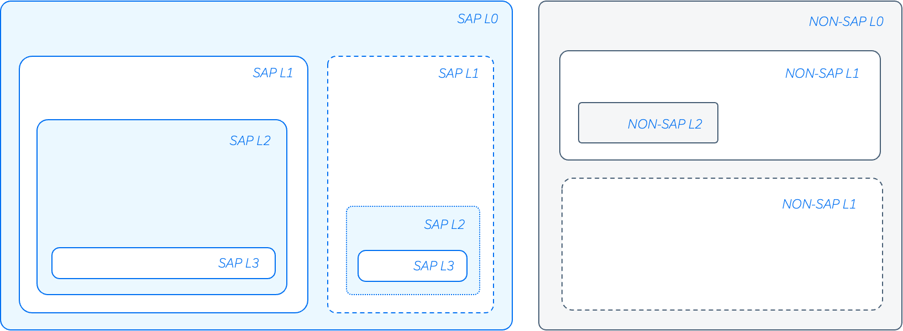

# Areas

*You will find the associated draw.io library in the  [GitHub repo](https://github.com/SAP/btp-solution-diagrams/tree/main/assets/shape-libraries-and-editable-presets/draw.io)*

## Area Types

Blue is the standard, grey for non-sap elements and the Accent colors are for highlighting certain areas.
It is not recommended to use the colors too heavily, they can overpower the diagram.
The picture shows the recommended rough proportional usage of colors in BTP Solution diagrams.
A fixed corner radius of 16 pixels is recommended.
For more details please check tool specifications for draw.io and PowerPoint.



## Primary Colors for Areas

| SAP L0 Outline   | SAP L0 Fill   | Non-SAP L0 <br />  Outline | Non-SAP L0 <br /> Fill | Text |  |
|:-:|:-:|:-:|:-:|:-:|:-:|
|| | | | | |
|``` #0070F2 ```| ``` #EBF8FF ```| ``` #475E75 ```|``` #F5F6F7 ``` | ``` #1D2D3E ```| ``` #556B82 ```|

## Accent/Emphasized Colors for Areas

| Teal Outline  | Teal Fill   | Indigo Outline | Indigo Fill | Pink Outline  | Pink Fill |
|:-:|:-:|:-:|:-:|:-:|:-:|
|| | | | | |
|``` #07838F ```| ``` #DAFDF5 ```| ``` #5D36FF ```|``` #F1ECFF ``` | ``` #CC00DC ```| ``` #FFF0FA ```|


## Area Cardinality

Areas can be shown as stacked to display multiple grouped layers or items. 
The style should not be changed in order to keep diagrams consistent.

<div className="area_cardinality">

</div>


## Area Nesting

When nesting different areas inside each other, you should alternate between using a fill and not using a fill to provide sufficient contrast between the areas.



## Adding Content to Areas and Creating Hierarchies

When nesting different areas inside each other, you should alternate between using a fill and not using a fill to provide sufficient contrast between the areas. The parent layer is usually the BTP layer. 


***Blue texts are just descriptions here.***
