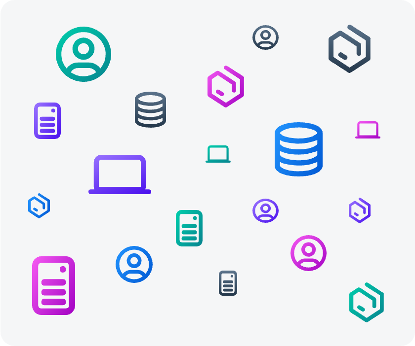

# Icons

## SAP Business Technology Platform Service Icons

This Icon Set has been recently redesigned and is used for all Services presented in SAP Discovery Center. 

:::tip Important
**For diagram visualization it is mandatory to use the version with grey background circle.**

*You will find the associated draw.io library in the  [GitHub repo](https://github.com/SAP/btp-solution-diagrams/tree/main/assets/shape-libraries-and-editable-presets/draw.io)*

:::

## Generic Icons

This set of icons with soft gradients is used for all elements that are either generic such as devices or databases. Use them additionally if you need to visualize specific content which does not have a visual representation.

**The primary color used is neutral grey.**

*You will find the associated draw.io library in the  [GitHub repo](https://github.com/SAP/btp-solution-diagrams/tree/main/assets/shape-libraries-and-editable-presets/draw.io)*
