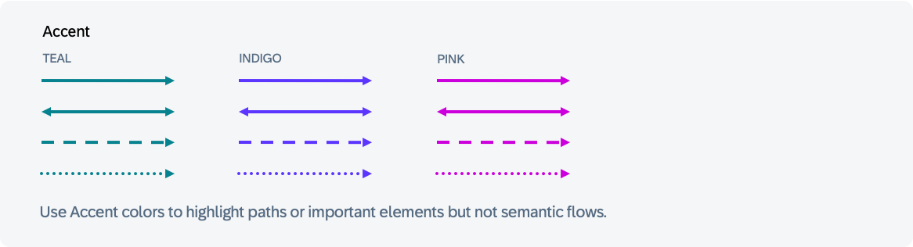
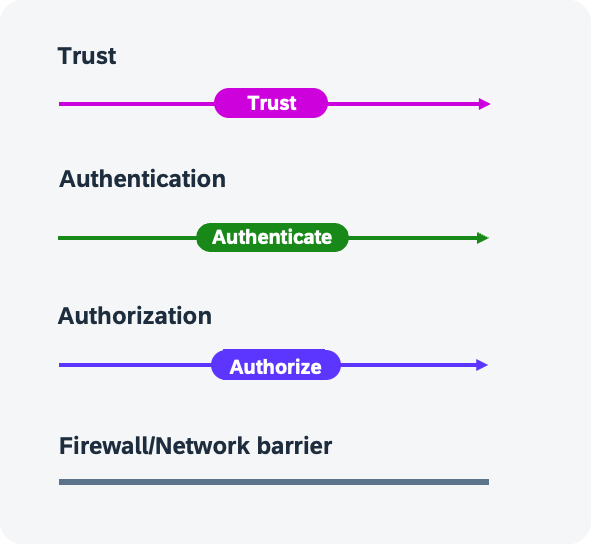
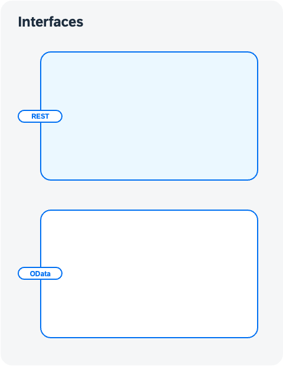

# Connectors

Connectors are non-, one- or bidirectional arrows.
For line style meaning please check the Foundation.

## Connector types

:::tip Data Flow
**The standard connectors are:**

**one-directional** data flows typically represent a request-response from client to server. 

**Bidirectional** solid arrows may represent mutual trust. 

:::

Use **semantic colors** to differentiate and add specific meaning to flows. 

Use **accent** colors to highlight paths or flows which are not semantic.

*You will find the associated draw.io library in the  [GitHub repo](https://github.com/SAP/btp-solution-diagrams)*

## Annotations and Firewalls

To harmonize certain reoccurring flows a use of the following standards is recommended:

- Trust Flows are usually pink
- Authentication flows are usually green
- Authorization flows are usually indigo
- Firewalls and Network barriers are thick grey lines

*You will find the associated draw.io library in the  [GitHub repo](https://github.com/SAP/btp-solution-diagrams)*

## Interfaces

This text describes what interfaces are for and how they are visually displayed.

*You will find the associated draw.io library in the  [GitHub repo](https://github.com/SAP/btp-solution-diagrams)*

