# Examples

## SAP Task Center Example - L1

Reusable BTP Solution Diagram Template can be found [here](https://github.com/SAP/btp-solution-diagrams/blob/main/assets/editable-diagram-examples/README.md)
  

## SAP Task Center Example - L2

Reusable BTP Solution Diagram Template can be found [here](https://github.com/SAP/btp-solution-diagrams/blob/main/assets/editable-diagram-examples/README.md)
  

## SAP Build Work Zone - L2

Reusable BTP Solution Diagram Template can be found [here](https://github.com/SAP/btp-solution-diagrams/blob/main/assets/editable-diagram-examples/README.md)
  

## SAP Cloud Identity Services - Authentication - L2

Reusable BTP Solution Diagram Template can be found [here](https://github.com/SAP/btp-solution-diagrams/blob/main/assets/editable-diagram-examples/README.md)
  

## Document Grounding - L2

Reusable BTP Solution Diagram Template can be found [here](https://github.com/SAP/btp-solution-diagrams/blob/main/assets/editable-diagram-examples/README.md)
  

## SAP Private Link Service - L2

Reusable BTP Solution Diagram Template can be found [here](https://github.com/SAP/btp-solution-diagrams/blob/main/assets/editable-diagram-examples/README.md)
  

