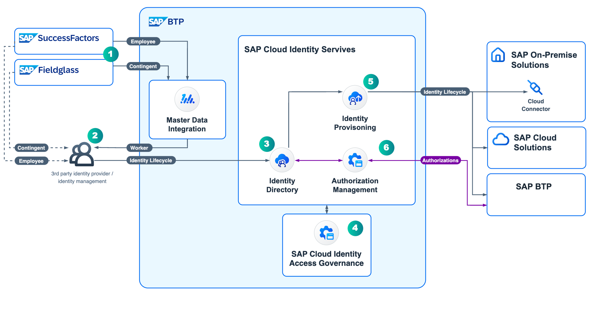
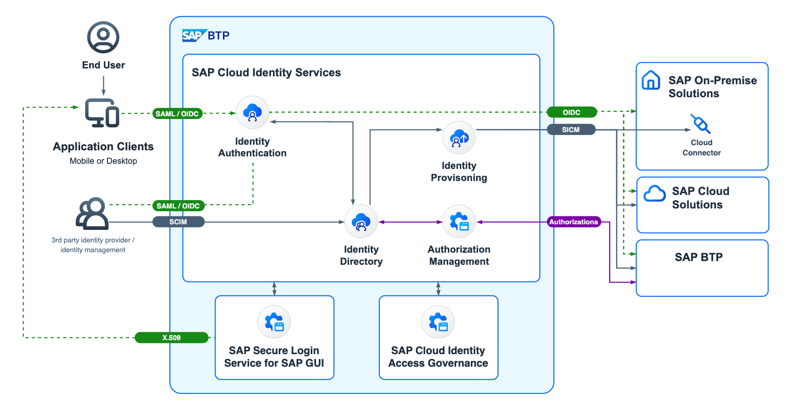

# Examples

## SAP Task Center Example - L0

## SAP Task Center Example - L1

## SAP Cloud Identity Services Example - L2

## SAP Cloud Identity Services Example - L3

## SAP Cloud Identity Services Example - L3/L4

