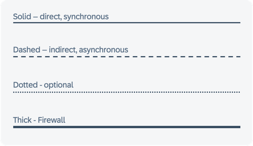
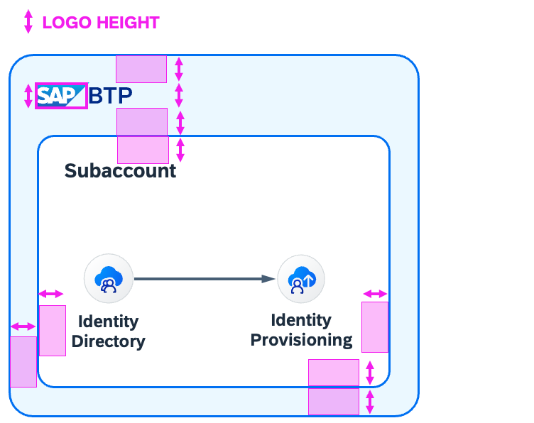

# Foundation (Atoms)

## Colors

Horizon is the default visual style for SAP Products. Its color balance helps to draw the user’s attention to the essential information and functions. It also promotes a distinct and consistent look throughout all products. This also applies to diagrams.

## Primary

The primary colors represent the overall look and feel.


| SAP/BTP Area   |    | Non-SAP Areas |  | Text |  |
|:-:|:-:|:-:|:-:|:-:|:-:|
|| | | | | |
|**Border**|**Fill**| **Border**|**Fill** | **Title**| **Text**|
|``` #0070F2 ```| ``` #EBF8FF ```| ``` #475E75 ```|``` #F5F6F7 ``` | ``` #1D2D3E ```| ``` #556B82 ```|

## Semantic

Semantic colors can be used to represent a negative, critical, positive, neutral, or information status.


|   |    |  |  |  |  |
|:-:|:-:|:-:|:-:|:-:|:-:|
|| | | | | |
|**Positive**|**Fill**| **Critical**|**Fill** | **Negative**| **Fill**|
|``` #188918 ```| ``` #F5FAE5 ```| ``` #C35500 ```|``` #FFF8D6 ``` | ``` #D20A0A ```| ``` #FFEAF4 ```|


## Accent/Emphasized

Secondary colors can be applied to accentuate important elements. They make a vivid contribution to the overall UI and should be used sparingly.


|   |    |  |  |  |  |
|:-:|:-:|:-:|:-:|:-:|:-:|
|| | | | | |
|``` #07838F ```| ``` #DAFDF5 ```| ``` #5D36FF ```|``` #F1ECFF ``` | ``` #CC00DC ```| ``` #FFF0FA ```|


## Line Styles

Arrow types in system architectures often represent various communication forms. Their meaning, which can vary based on the specific notation or individual definitions, isn't universally standardized. Generally, a solid arrow means direct communication, while a dashed arrow implies indirect communication. Including a legend in each diagram is crucial to clarify these meanings.

:::tip
**Recommended styles for BTP Solution Diagrams are:**
- Solid lines for direct, synchronous request-response data flows
- Dashed lines for indirect, asynchronous data flows
- Dotted lines for optional data flows
- Thick lines for firewalls only




:::
## Spacing

Good spacing helps making a diagram look clean and professional. Make sure Elements have enough space to “breathe”.
To ensure you have good spacing, this you can follow a rule of thumb: Spacing around objects should be even and roughly the height of the SAP Logo.


