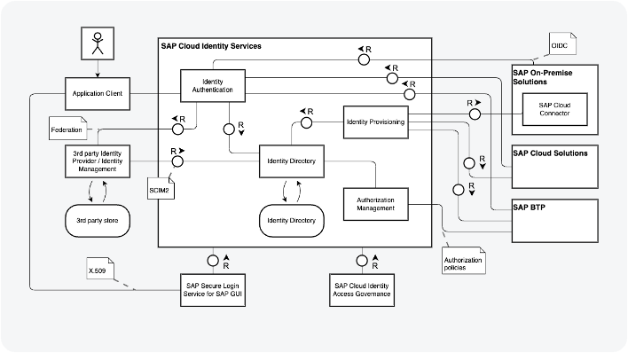
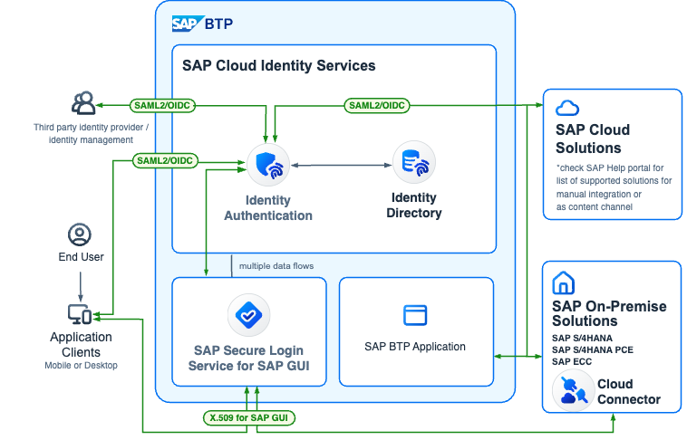
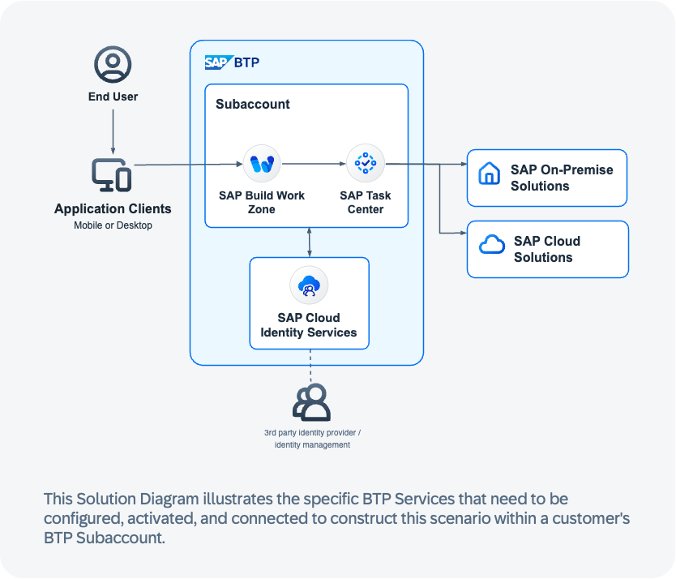

# Big Picture

## What is a SAP BTP Solution Diagram

**SAP Business Technology Platform Solution Diagrams provide high-level, abstract illustrations of technical landscapes.**

They are instrumental in helping customers understand the range of BTP Services and Solutions that SAP provides, and how these integrate with other SAP products. 

These domain-specific diagrams showcase solution scenarios across IT landscapes by depicting SAP BTP services, systems, environments and their interdependencies. 

The focus for BTP Solution Diagrams is on creating visually compelling and insightful high-level solution architectures based on the SAP Fiori Horizon design system.

## What is the difference between TAM and Solution Diagrams?
<table>
  <tbody>
    <tr>
      <th align="center"></th>
      <th align="center"></th>
    </tr>
    <tr>
      <td align="center"></td>
      <td align="center"></td>
    </tr>
    <tr>
      <td align="center"><b>TAM</b></td>
      <td align="center"><b>SAP BTP Solution Diagrams & Icons</b></td>
    </tr>
    <tr>
      <td >
 <ul>
          <li>Technical and detailed description of architectures, use cases and processes</li>
          <li>Reduced and standardized icon and shape set.</li>
          <li>Can be used at any design level</li>
        </ul>
</td>
      <td > <ul>
          <li>Domain-specific diagram type that describe  SAP Business Technology Platform solution scenarios  across IT landscapes.  Show SAP Business Technology Platform  services, environments, systems, and their interdependencies.</li>
          <li>Specific icons for SAP BTP services.</li>
          <li>Focus on high-level visually pleasing solution architectures</li>
        </ul></td>
    </tr>
   
  </tbody>
</table>

## Target Audience for BTP Solution Diagrams

**BTP solution diagrams can be crafted with varying degrees of detail and tailored to the technical proficiency of the intended audience.** Drawing a parallel to L0 - L2/L3 presentations, these diagrams allow different levels of interpretation by diverse audiences. This has the advantage of being applicable to both internal interested parties and external entities such as customers and business partners.

<table>
  <tbody>
    <tr>
      <th align="center">Level 0 </th>
      <th align="center">Level 1</th>
      <th align="center">Level 2</th>
    </tr>
    <tr>
      <td align="left"><b>L0 diagrams target individuals who simply require an overview.</b> They typically possess just rudimentary technical knowledge and interest.  This group potentially includes, but is not limited to, <b>professionals in business roles, sales roles, business architects, enterprise architects, IT managers, IT analysts, and even Chief Technology Officers.</b></td>
      <td align="left"><b>L1 diagrams target Individuals who possess a strong technical acumen and interest.</b> They often participate in technical decision-making processes.    This group could include, but isn't limited to,<b> enterprise architects, solution architects, SAP consultants, product managers, professionals in sales and presales roles, along with use case owners and DC mission owners.</b></td>
      <td align="left"><b>L2 diagrams target individuals with an extensive technical understanding, requiring detailed information to inform their decision-making process.</b>    The group potentially includes, but isn't exclusive to, <b>SAP Solution Architects, Cloud Architects, Product Managers, individuals in business and development roles, consultants, use case owners, or DC mission owners, as well as those in technical presales roles.</b></td>
    </tr>
    
   
  </tbody>
</table>

## Diagram Granularity for L0 audiences

**The granularity of diagrams should be adjusted according to the expertise of the intended audience. For example, the broadest level of detail, Level 0, caters mainly to individuals with basic technical skills, such as those in business roles.**

L0 Diagrams

A representative example would be a high-level solution diagram featuring BTP Services and simplified flows, without complex technical details. In such diagrams, connectors maintain neutrality and the content is streamlined to essentials, eliminating the necessity for a legend, but a short description is recommended.

## Good to know

**Specifications for Diagramming PowerPoint**

For the creation of BTP Solution diagrams using PowerPoint, it is advisable to initially download the PowerPoint starter kit. This kit comes with a PowerPoint template that includes the fundamental atoms and molecules of the design system. It also has a selection of comprehensive and editable example diagrams. 

The starter kit can be obtained [here](https://github.com/SAP/btp-solution-diagrams/blob/main/assets/all-in-one-starter-kits/README.md).

**Please note that PowerPoint has certain inherent design constraints:**

- Corner radius values can't be numerically altered but need to be adjusted manually. This could potentially lead to variances in the corner radius of shapes. Consequently, it is advisable to thoroughly review all corner radii upon the completion of your diagram. Make individual adjustments as necessary to ensure uniformity.

- Slide dimensions are unalterable, so if you find the available space inadequate for your diagram, avoid downscaling all the elements to accommodate it. The text sizes and line styles in the provided templates have been meticulously designed to complement the tool and target medium. If your diagram is too large for PowerPoint, consider switching to draw.io. This open-source tool provides extensive functionality.

- To use BTP Service icons in PowerPoint, you must download the SVG library separately from the repository.

**Specifications for Diagramming Draw.io**

To design BTP Solution diagrams in draw.io, we recommend you begin by downloading the draw.io starter kit. This comprehensive kit comes with an abundant library complete with the fundamental atoms and molecules of the system design. Additionally, it includes a variety of detailed, customizable example diagrams.

You can access the starter kit [here](https://github.com/SAP/btp-solution-diagrams/blob/main/assets/all-in-one-starter-kits/README.md).

**Please note that draw.io has certain inherent design limitations:**

- All elements are designed for seamless dragging onto the canvas. You can resize, connect, and extend these elements without compromising their original style and spacing. However, certain shape modifications might inadvertently trigger undesired changes due to the tool's inherent functionality. Should this occur, please don't hesitate to contact us.

- When scaling elements up or down, take care to ensure text sizes remain consistent. The text sizes and line styles in our provided templates are carefully chosen to perfectly complement the tool and the target medium.

- Avoid creating your own arrows; use the ones available in the library instead as they adhere to the correct styling guidelines.

