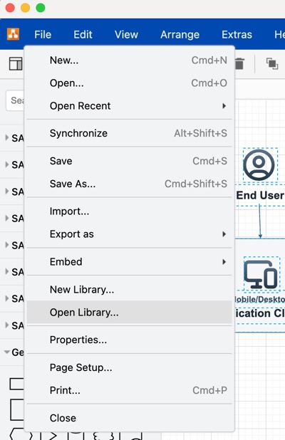
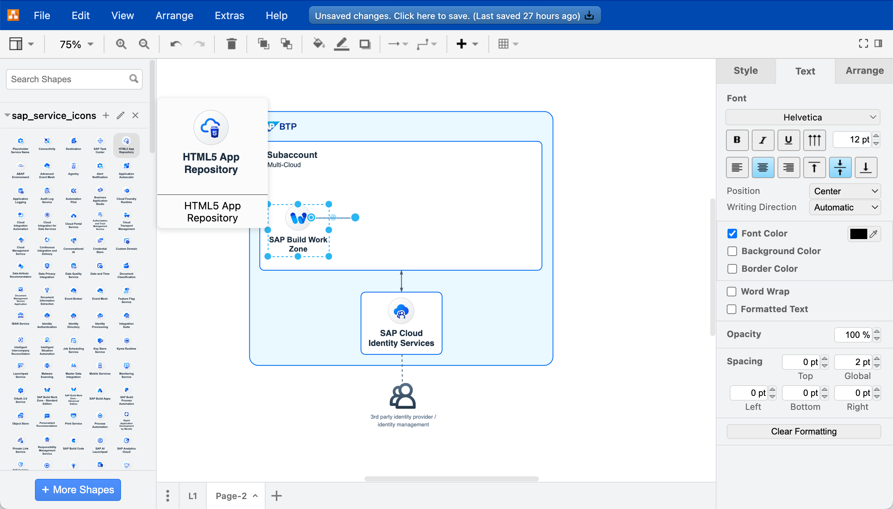
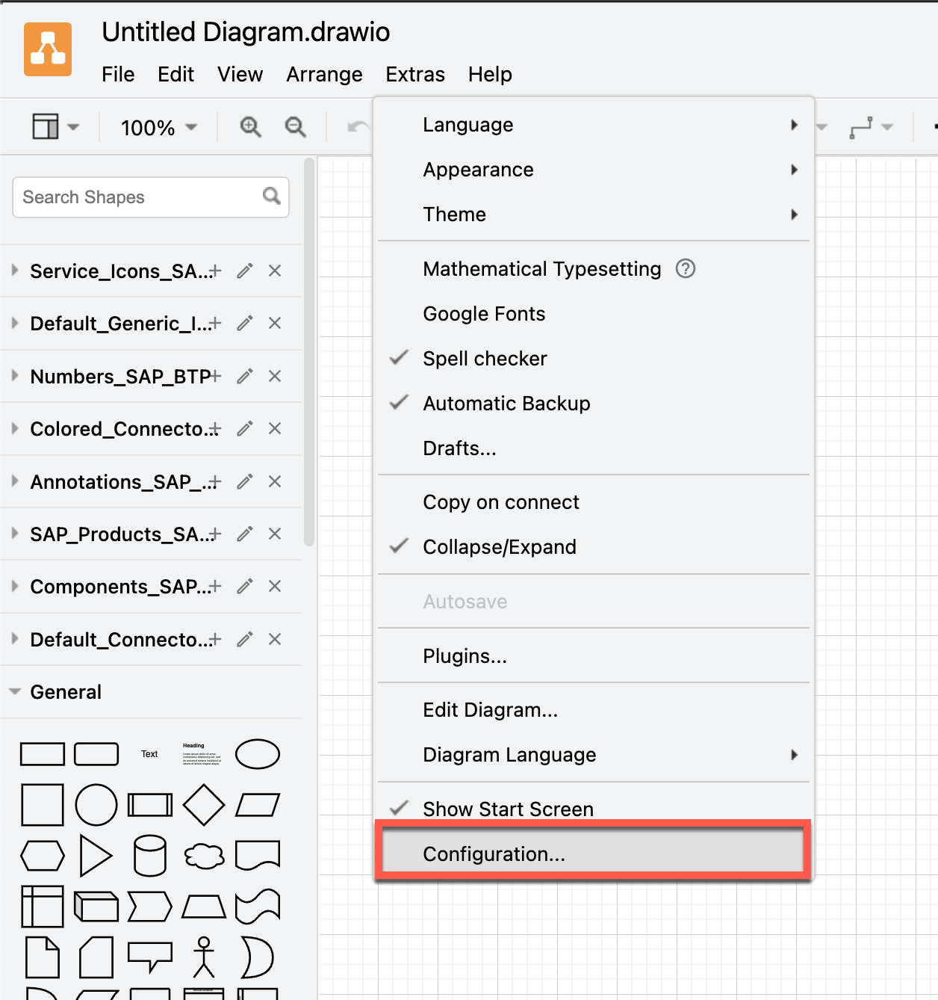
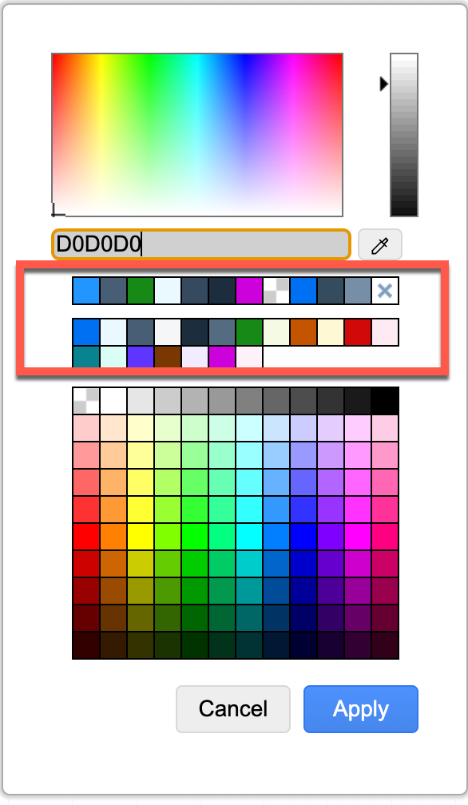
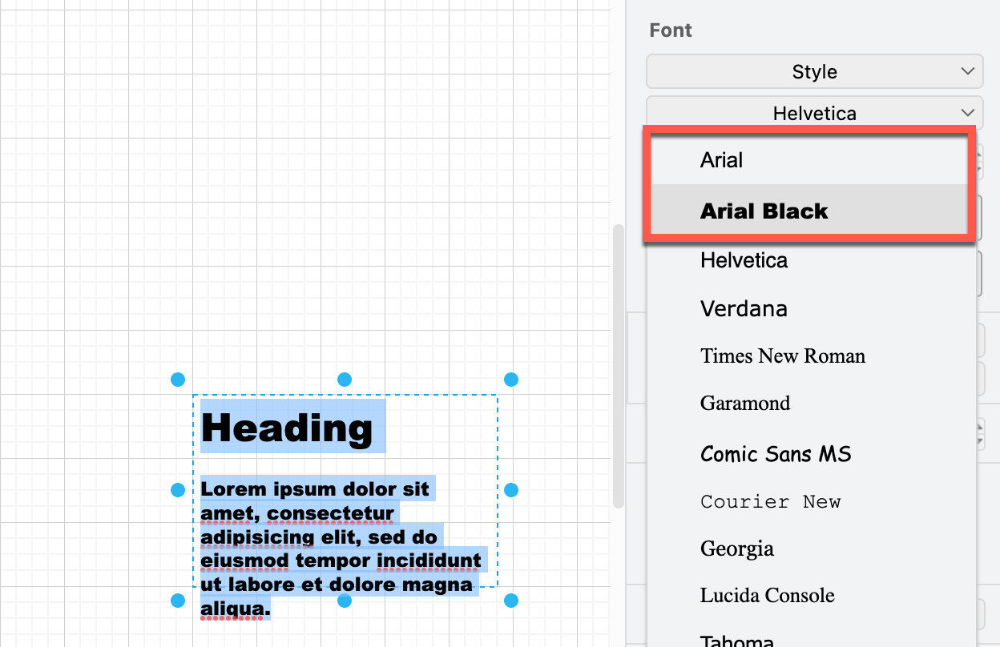
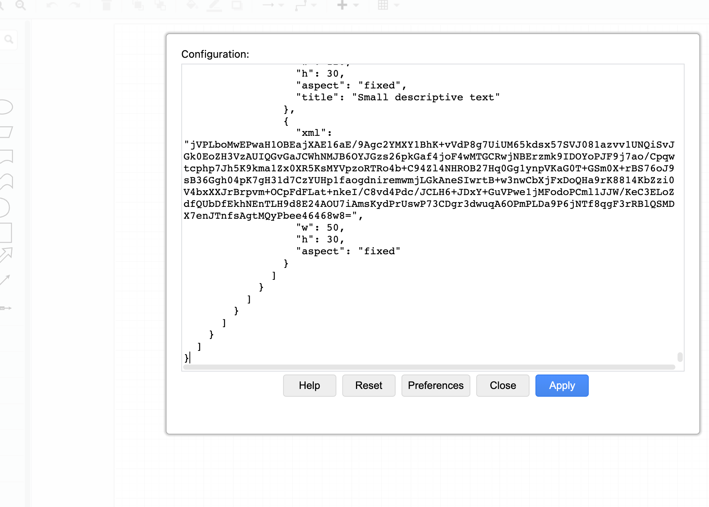
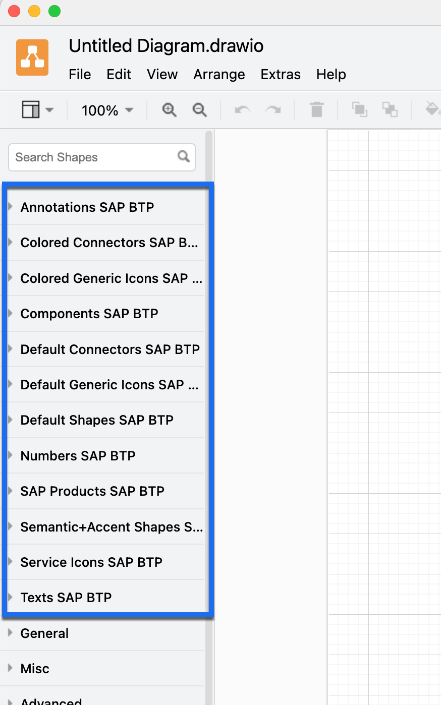
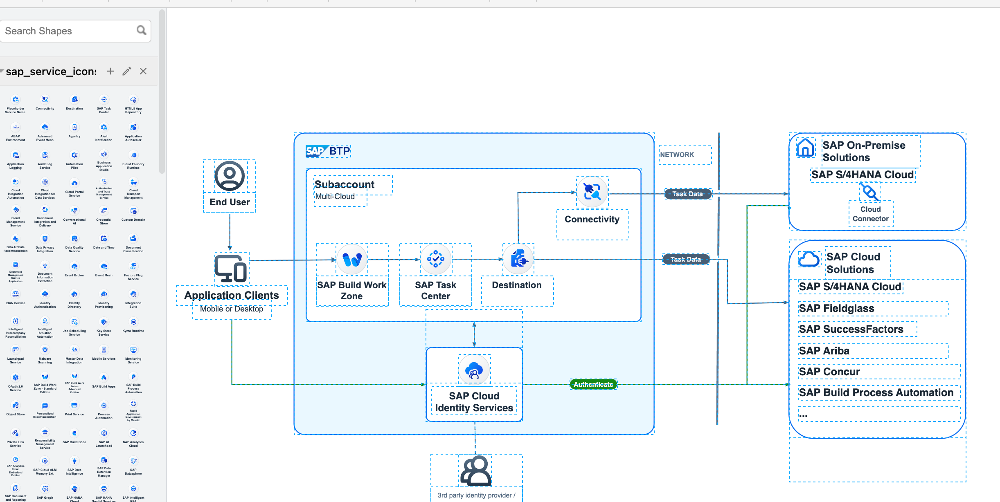

# Getting started 

BTP Solution Diagrams give you a quick and effective understanding of SAP Business Technology Platform end-to-end solution scenarios. To get started using the diagrams, you can use the following resources to familiarize yourself with the diagram guidelines and examples before installing the editor and importing the libraries.

## Before you start using BTP Solution Diagrams

- Consult the SAP BTP Solution Diagram guideline. It is based on the new Horizon 2023 design principles and gives you the basic information you need to start using the templates to build your solution diagram.

-	Download the [draw.io libraries](https://github.com/SAP/btp-solution-diagrams/tree/main/assets/shape-libraries-and-editable-presets/draw.io). 

- Consult the Visual Design Guideline topic available in the content list panel to the left of this page to understand the different diagram elements available in the repository. You can also get it here: [PDF](https://d.dam.sap.com/a/UbBJrVh/SAP-BTP-solution-diagram-design-guideline-v1-public.pdf?rc=10)

- If you only use PowerPoint, then you can also use the provided shapes; check out the examples here: [PPT](https://d.dam.sap.com/a/e7KMGSu?rc=10)

**If you want to have a quick start we also provide a starter kit for **draw.io** [here](https://github.com/SAP/btp-solution-diagrams/tree/main/assets/all-in-one-starter-kits)**

## Installing the diagram editor - the right tool for the right job

1.	Install the drawing software draw.io on your local machine. You can get your local draw.io copy at GitHub [repository](https://github.com/jgraph/drawio-desktop/releases).


## Import libraries

1.	Import the provided "xml" files to make use of the assets (draw.io custom shapes).
2.	Open a custom shape library.

    
3. Click File > Open Library from, then then select the folder where your file is stored.
4. Select your custom library, then click Choose. **You can now start working with the diagram.**

   

## Configure draw.io with SAP Color Scheme

Draw.io supports different options to customize the look & feel, for more details check also the [documentation](https://www.drawio.com/doc/faq/configure-diagram-editor)

To add the SAP colors schema for the SAP BTP Solution Diagrams you can edit the configuration choosing **Extras > Configuration** from the menu.
<div className="drawio_color">

</div>
In the configuration screen you can copy & paste the following configuration and apply the changes afterwards:

```
{
  "customColorSchemes": [
    [
      {
        "fill": "#0070F2",
        "stroke": "none"
      },
      {
        "fill": "#EBF8FF",
        "stroke": "none"
      },
      {
        "fill": "#475E75",
        "stroke": "none"
      },
      {
        "fill": "#F5F6F7",
        "stroke": "none"
      },
      {
        "fill": "#1D2D3E",
        "stroke": "none"
      },
      {
        "fill": "#556B82",
        "stroke": "none"
      },
      {
        "fill": "#188918",
        "stroke": "none"
      },
      {
        "fill": "#F5FAE5",
        "stroke": "none"
      },
      {
        "fill": "#C35500",
        "stroke": "none"
      },
      {
        "fill": "#FFF8D6",
        "stroke": "none"
      },
      {
        "fill": "#D20A0A",
        "stroke": "none"
      },
      {
        "fill": "#FFEAF4",
        "stroke": "none"
      },
      {
        "fill": "#DAFDF5",
        "stroke": "none"
      },
      {
        "fill": "#5D36FF",
        "stroke": "none"
      },
      {
        "fill": "#F1ECFF",
        "stroke": "none"
      },
      {
        "fill": "#CC00DC",
        "stroke": "none"
      },
      {
        "fill": "#FFF0FA",
        "stroke": "none"
      }
    ]
  ],
  "presetColors": [
    "0070F2",
    "EBF8FF",
    "475E75",
    "F5F6F7",
    "1D2D3E",
    "556B82",
    "188918",
    "F5FAE5",
    "C35500",
    "FFF8D6",
    "D20A0A",
    "FFEAF4",
    "07838F",
    "DAFDF5",
    "5D36FF",
    "793802",
    "F1ECFF",
    "CC00DC",
    "FFF0FA"
  ]
}
```

After a restart of draw.io the adopted color schema should be visible:
<div className="drawio_color_ready">

</div>

## Add custom fonts to draw.io

You can also customize the usage of custom fonts which are installed on your device or you can make use of Google fonts. You can get more information in the official [documentation](https://drawio-app.com/blog/customise-default-colours-fonts-styles-and-the-draw-io-ui-in-confluence-cloud/).

To add the sytem fonts **Arial** and **ArialBlack** to your local draw.io installation you can add the following to the *configuration*:

```
"customFonts": [
    "Arial",
    "Arial Black"
  ]
```

After a restart of draw.io you can now make use of the new fonts:

<div className="drawio_font_select">

</div>

## Add SAP colors, BTP Icons, Logos etc. to draw.io configuration at once

In addition to the single steps to adjust the colors or fonts, you can also add the other assets like BTP Icons & Logos etc.

By using this "all-in-one" json:
https://github.com/SAP/btp-solution-diagrams/blob/main/guideline/docs/examples/drawio-config-all-in-one.json
you can copy and paste this in the configuration of draw.io desktop:

<div className="drawio_config">

</div>

Finally after a restart of draw.io you have all *SAP* libraries preloaded:

<div className="drawio_config_res">

</div>


## Reusable diagram examples

You don’t have to start creating each element from scratch. We provide ready to use examples and templates to use or adjust SAP BTP Solution Diagrams easily to your personal needs.



## Contact or help required

In case of questions please get in contact with us via GitHub discussions [here](https://github.com/SAP/btp-solution-diagrams/discussions)


